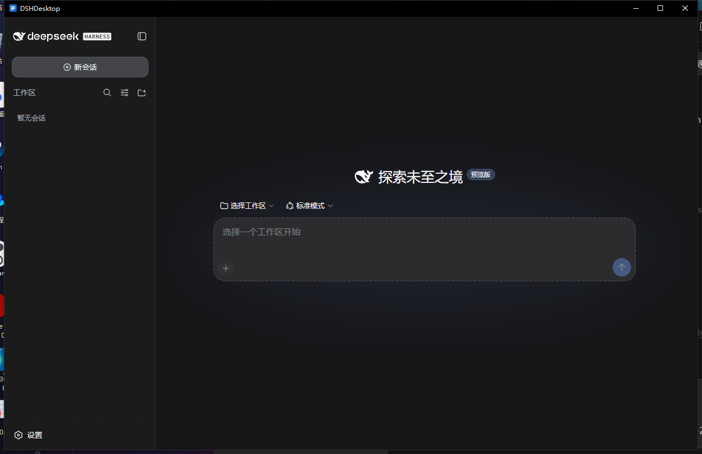
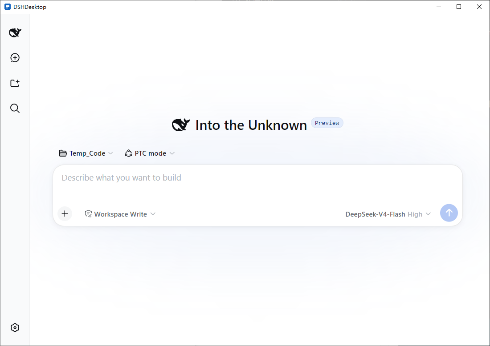

# DSHDesktop

[English](README.md) | Chinese

[deepseek-harness](https://github.com/deepseek-ai/deepseek-harness)（dsh，DeepSeek 的 agent harness CLI）的 Windows 桌面壳应用。安装包内嵌便携版 Node.js 运行时与 `@deepseek-ai/dsh`，dsh 官方 Web UI 像普通 Windows 应用一样运行，无需任何前置依赖。

| 深色 | 浅色 |
| --- | --- |
|  |  |

## 功能

- **零前置依赖。** Node.js 24 与 dsh 随安装包分发，Windows 10/11 x64 装完即用。缺少 WebView2 时安装程序会自动安装。
- **原生窗口中的官方界面。** 在空闲回环端口拉起 `dsh web`，就绪后立即打开官方 Web UI。
- **引导式首次启动。** 首次初始化时，分阶段进度条展示运行时准备、服务启动与就绪进度。
- **托盘常驻。** 关窗隐藏到托盘。托盘菜单：打开主界面、诊断、重启服务、退出。
- **原生通知。** 窗口隐藏时，dsh 的批准请求与提问转为 Windows 通知。
- **崩溃自愈。** dsh 进程受监督，崩溃后按指数退避自动重启。
- **主题跟随。** 标题栏实时跟随 dsh 的浅色、深色或跟随系统设置。
- **诊断面板。** 服务状态、端口、PID、实时日志、一键重启与开机自启开关。
- **单实例。** 重复启动只会聚焦已有窗口。

## 下载与安装

从 [Releases](../../releases) 下载 `DSHDesktop_<版本>_x64-setup.exe` 并运行。无需管理员权限，按用户安装。

- 安装后约 242 MB（安装包约 45 MB）
- 用户数据在 `%LOCALAPPDATA%\DSHDesktop\`（dsh 设置、会话与日志）
- 静默安装：`DSHDesktop_<版本>_x64-setup.exe /S`（加 `/D=C:\path\to\dir` 可指定安装目录）
- 升级：从托盘菜单退出应用或卸载旧版，然后运行新安装包

> DSHDesktop 是非官方的社区壳应用。dsh 本体由 DeepSeek 在 [deepseek-ai/deepseek-harness](https://github.com/deepseek-ai/deepseek-harness) 开发。

## 工作原理

```
主窗口（启动画面，随后打开官方 dsh Web UI，http://127.0.0.1:<port>）
      │ Tauri IPC
Rust 核心：运行时 / 进程监督 / 托盘 / 通知 / 主题 / 诊断
      │ spawn（无控制台窗口，DSH_HOME 隔离到应用数据目录下）
内嵌 node.exe + dsh web --port <空闲端口>（仅绑 127.0.0.1）
```

dsh 事件（批准请求、提问）通过其 WebSocket 通道 `/api/events.mux` 订阅。平台相关代码全部收敛在 `Platform` trait 后面，为 macOS 与 Linux 预留了空间。详见 [设计文档](docs/design.zh-CN.md)。

## 从源码构建

前置：Rust（稳定版）、Node.js 22 或更高、pnpm 11。

```bash
pnpm install

# 准备内嵌运行时（二选一）
powershell -File scripts/fetch-runtime.ps1        # 真实运行时（Node 24 + dsh 0.1.0-rc.6）
powershell -File scripts/use-fixture-runtime.ps1  # 轻量 fake-dsh fixture，供壳调试

pnpm tauri dev
```

测试与检查：

```bash
cd src-tauri && cargo test     # Rust 单元与集成测试（30 个）
pnpm check && pnpm build       # 前端类型检查与构建
```

打包 NSIS 安装包：

```bash
powershell -File scripts/fetch-runtime.ps1
pnpm tauri build               # 产物：src-tauri/target/release/bundle/nsis/DSHDesktop_*_x64-setup.exe
```

真实安装上的端到端验收（卸载、安装、启动、全项校验、截图）：

```powershell
powershell -File scripts/acceptance.ps1 -SetupExe src-tauri/target/release/bundle/nsis/DSHDesktop_0.1.0_x64-setup.exe
```

## 项目文档

- [设计文档](docs/design.zh-CN.md)（中文）与[英文版](docs/design.md)：架构、模块、打包、测试、已知限制
- [AGENTS.md](AGENTS.md)：贡献指南，含目录结构、常用命令与坑
- [CHANGELOG.md](CHANGELOG.md)：版本历史

## 多平台路线

当前仅 Windows x64。平台差异都收口在 `src-tauri/src/platform/`（`Platform` trait）。启用 CI matrix 中 macOS 与 Linux 行前，需实现 `platform/{macos,linux}.rs` 并让 `scripts/fetch-runtime.ps1` 支持对应 triplet。见设计文档第 10 节。

## License

[MIT](LICENSE)
